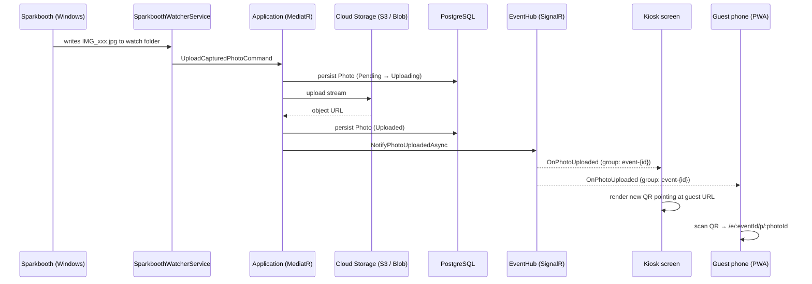

# Pix Dynamic Gallery

Real-time companion platform for **Sparkbooth** photobooth events. It watches the local folder
where Sparkbooth saves each capture, uploads it to cloud storage, and pushes it live — over
SignalR — to a kiosk screen (with a dynamic QR code) and to every guest's phone via a mobile-first
PWA and a Pinterest-style live wall.

> **Status:** Full stack built and running in production — backend (.NET 9), frontend (Angular 22
> on Cloudflare Pages), Neon Postgres, Cloudflare R2 storage, Cloudflare Tunnel. The one remaining
> step is installing it on the actual photobooth cabin PC — see
> [Production deployment](#production-deployment). For the detailed history of every provisioning
> decision and the current state of each step, see [`ESTADO_PROYECTO.md`](ESTADO_PROYECTO.md).

## How it works



## Architecture

Clean Architecture, four projects, dependencies point inward only:

```
src/
├── PixDynamicGallery.Domain          # Entities, enums, domain exceptions — zero dependencies
├── PixDynamicGallery.Application     # Use cases (MediatR commands/queries), DTOs, interfaces
├── PixDynamicGallery.Infrastructure  # EF Core, S3/Azure storage, FileSystemWatcher, everything external
└── PixDynamicGallery.Api             # Controllers, SignalR hub, Program.cs, middleware
```

| Layer | Depends on | Knows about |
|---|---|---|
| **Domain** | nothing | `Event`, `Photo`, `PhotoStatus`, domain invariants |
| **Application** | Domain | Use cases, `IStorageService`, `IPhotoNotifier`, `IApplicationDbContext` — abstractions only |
| **Infrastructure** | Application | EF Core/Npgsql, AWS S3 / Azure Blob SDKs, `SparkboothWatcherService` |
| **Api** | Application, Infrastructure | Controllers, `EventHub`, DI composition, exception → `ProblemDetails` mapping |

Application never references Infrastructure or SignalR directly — it depends on interfaces
(`IStorageService`, `IPhotoNotifier`, `ILocalCaptureFileReader`, `IApplicationDbContext`) that
Infrastructure/Api implement. Swapping AWS S3 for Azure Blob, or Postgres for another provider, is
a DI registration change in `Infrastructure/DependencyInjection.cs` — no other layer is touched.

### Key building blocks

- **`SparkboothWatcherService`** (`Infrastructure/Watcher`) — a `BackgroundService` that runs one
  `FileSystemWatcher` per *active* `Event.WatchFolderPath`, re-scanning the `Events` table every
  `Watcher:RefreshIntervalSeconds` so new/deactivated events are picked up without a restart. Every
  new capture dispatches `UploadCapturedPhotoCommand` through MediatR.
- **`UploadCapturedPhotoCommand`** (`Application/Photos/Commands`) — the single pipeline from
  "file appeared on disk" to "guests see it": persists a `Pending` `Photo`, uploads the stream via
  `IStorageService`, marks it `Uploaded`, and broadcasts it via `IPhotoNotifier`. The manual
  `POST /api/events/{eventId}/photos` endpoint (multipart upload) runs through the exact same
  command — useful for testing without Sparkbooth hardware attached.
- **`LocalCaptureFileReader`** (`Infrastructure/Files`) — opens the captured file with retry +
  backoff. `FileSystemWatcher` can raise `Created` before the writer's handle is released (common
  with larger GIFs on slower storage); this absorbs that race instead of failing the upload.
- **`EventHub`** (`Api/Hubs`) — SignalR hub; clients call `JoinEventGroup(eventId)` to receive
  `OnPhotoUploaded` / `OnPhotoFailed` broadcasts scoped to that event only.
- **MediatR pipeline behaviours** (`Application/Common/Behaviours`) — `ValidationBehaviour` runs
  every `FluentValidation` validator before a handler executes; `UnhandledExceptionBehaviour` logs
  anything that still escapes. `ExceptionHandlingMiddleware` (Api) turns both, plus domain/not-found
  exceptions, into RFC 7807 `ProblemDetails` responses.

## Tech stack

- **.NET 9**, ASP.NET Core Web API + SignalR
- **MediatR** (CQRS-style commands/queries) + **FluentValidation**
- **EF Core 9** on **PostgreSQL** (Npgsql)
- **AWS SDK for S3** / **Azure.Storage.Blobs** behind a single `IStorageService` abstraction
- **Serilog** (console sink, request logging)
- **Swashbuckle** (Swagger/OpenAPI, enabled in Development)
- Docker / docker-compose for local orchestration

## Getting started

### Option A — Docker (Postgres + MinIO + API, one command)

```bash
docker compose up --build
```

This starts Postgres, a MinIO bucket (S3-compatible, so the storage pipeline works without a real
AWS/Azure account), the API on **http://localhost:8080** (Swagger at `/swagger` in Development),
and the Angular frontend on **http://localhost:4200**. Migrations run automatically on startup; a
`demo` event is seeded.

> The watcher monitors a folder path stored *on the `Event` row*, not a path baked into the
> container. To let the containerized API see files Sparkbooth writes on the Windows host, that
> folder is bind-mounted in `docker-compose.yml` (the API service's `volumes:` entry, currently
> `C:\SparkboothPhotos` → `/data/sparkbooth`) — set the event's `WatchFolderPath` to the
> container-side path, not the Windows one, or events will point at a path the container can't see
> (a real bug hit twice during development, see the bugs list in `ESTADO_PROYECTO.md`). For a real
> kiosk deployment, run the API natively on the kiosk PC instead — see
> [Production deployment](#production-deployment).

### Option B — Local .NET

Requires the .NET 9 SDK and a reachable PostgreSQL instance.

```bash
dotnet restore
dotnet ef database update --project src/PixDynamicGallery.Infrastructure --startup-project src/PixDynamicGallery.Api
dotnet run --project src/PixDynamicGallery.Api
```

Update `src/PixDynamicGallery.Api/appsettings.Development.json` (or user-secrets) with your
`ConnectionStrings:Postgres` and `Storage` credentials first.

### Creating an event

```bash
curl -X POST http://localhost:8080/api/events \
  -H "Content-Type: application/json" \
  -d '{
        "name": "Julia & Mark'\''s Wedding",
        "slug": "julia-and-mark",
        "watchFolderPath": "C:\\SparkboothPhotos\\JuliaAndMark",
        "guestBaseUrl": "https://gallery.mystudio.com"
      }'
```

Set `Event.WatchFolderPath` to wherever Sparkbooth is configured to save that event's captures.
Once the event is active, `SparkboothWatcherService` picks it up on its next refresh cycle
(≤ `Watcher:RefreshIntervalSeconds`, default 60s).

## Configuration reference

All of the below are standard ASP.NET Core configuration keys — set via `appsettings.json`,
environment variables (`Storage__AwsS3__BucketName`), or user-secrets in Development.

| Key | Purpose |
|---|---|
| `ConnectionStrings:Postgres` | EF Core / Npgsql connection string |
| `Storage:Provider` | `AwsS3` or `AzureBlob` |
| `Storage:PublicRead` | Whether uploaded objects are set public-read (MVP default) |
| `Storage:AwsS3:*` | Bucket, region, credentials; `ServiceUrl`/`PublicServiceUrl` for S3-compatible endpoints (MinIO); `PublicUrlBase` instead for providers whose public URL has no bucket segment (Cloudflare R2) |
| `Storage:AzureBlob:*` | Connection string, container name |
| `Watcher:Enabled` | Master on/off switch for `SparkboothWatcherService` |
| `Watcher:RefreshIntervalSeconds` | How often the watcher re-reads active events from the DB |
| `Cors:AllowedOrigins` | Origins allowed to call the API / connect to the SignalR hub (credentialed CORS) |

## API surface

| Method | Route | Purpose |
|---|---|---|
| `POST` | `/api/events` | Create an event |
| `GET` | `/api/events/{slug}` | Resolve an event by its URL slug |
| `GET` | `/api/events/{eventId}/photos` | Paginated, uploaded-only photo feed (live wall) |
| `GET` | `/api/events/{eventId}/photos/{photoId}` | Single photo (guest landing page) |
| `POST` | `/api/events/{eventId}/photos` | Manual multipart upload — same pipeline as the watcher |
| `WS` | `/hubs/event` | SignalR hub — `JoinEventGroup`/`LeaveEventGroup`, receives `OnPhotoUploaded`/`OnPhotoFailed` |

Full request/response contracts are in Swagger (`/swagger`) when running in Development.

## Roadmap

1. ~~Backend: Clean Architecture, SignalR, cloud storage, watcher~~ ✅
2. ~~Angular 22 frontend (standalone components, signals, zoneless): kiosk, guest PWA, live wall,
   admin~~ ✅
3. ~~Client-side QR generation on the kiosk (no external API)~~ ✅
4. ~~Production deploy: Cloudflare Pages (frontend), R2 (storage), Neon (Postgres), Tunnel (API)~~
   ✅ — see [Production deployment](#production-deployment)
5. **Install and run on the actual photobooth cabin PC** — see
   [`tools/booth/README.md`](tools/booth/README.md)
6. Real-world test: create an event and use it from a phone on mobile data (not local WiFi)
7. Authentication for event management endpoints
8. Integration tests (`WebApplicationFactory`) + unit tests for Application handlers

## Production deployment

Target cost: **$0/month** (+ ~$10/year for the domain). Each piece runs on a different
provider's free tier, chosen for a specific constraint:

| Piece | Where | Why |
|---|---|---|
| Frontend | **Cloudflare Pages** (`somospix.com`) | Free CDN, auto-deploy from this repo's `main` branch. Deployed via `npx wrangler deploy` — see `frontend/wrangler.jsonc` |
| API + watcher | **Native on the photobooth cabin PC** | The watcher needs the real local filesystem — it can't run in the cloud without adding a separate sync agent |
| Exposing the API | **Cloudflare Tunnel** (`api.somospix.com` → `localhost:8080`) | No port-forwarding, works behind any venue's WiFi/NAT, supports WebSockets (SignalR) |
| Database | **Neon** (serverless Postgres) | Free tier, sleeps when idle — irrelevant for per-event usage |
| Photo storage | **Cloudflare R2** | S3-compatible (same `IStorageService` code as MinIO), and no egress cost — guests repeatedly view/download photos |

**The actual next step to bring an event online is the cabin PC install**, documented end to end
in [`tools/booth/README.md`](tools/booth/README.md): installing the .NET 9 Runtime (not the SDK)
and `cloudflared`, publishing the API, filling in the R2/Neon/Tunnel secrets, and configuring the
kiosk browser. For the full history of *why* each provider/choice was picked and the current state
of every provisioning step, see [`ESTADO_PROYECTO.md`](ESTADO_PROYECTO.md).

### Local Docker vs. production

`docker compose up` (Option A above) is for **local development only** — MinIO stands in for R2,
and the watcher's polling fallback compensates for Docker Desktop/WSL2 not forwarding `inotify`
events for Windows bind mounts (see the comment atop `docker-compose.yml`). Production doesn't use
Docker for the API at all (see table above), and Cloudflare Pages builds the frontend straight from
`frontend/` without the Docker image either — `frontend/docker/*` only matters for a self-hosted
Docker deploy, not for the Cloudflare Pages path.

### Scaling

The API is stateless aside from the watcher's in-memory `FileSystemWatcher` handles — scale
horizontally only if you disable `Watcher:Enabled` on the extra replicas (otherwise every replica
uploads the same file). In practice there's a single cabin PC per event, so this doesn't apply yet.

---

Built as a portfolio project — Clean Architecture, SOLID, containerized, real-time by design.
